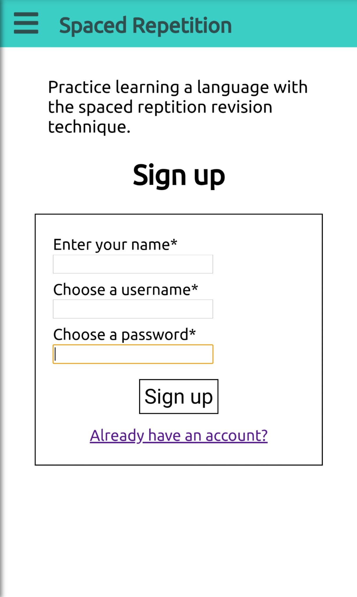
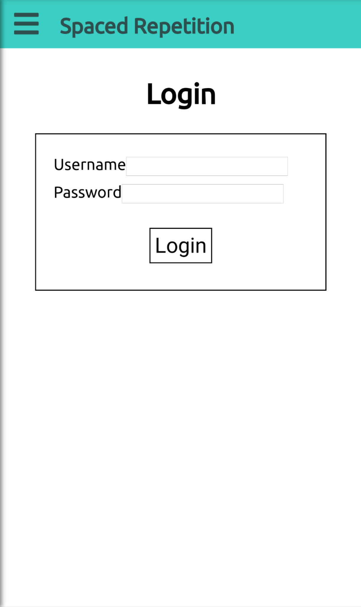
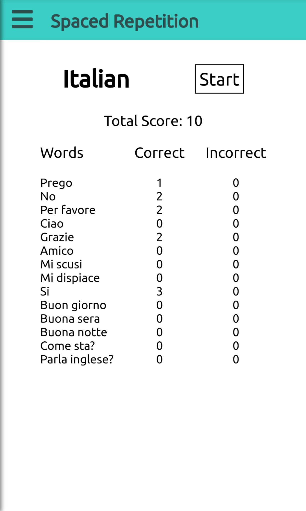
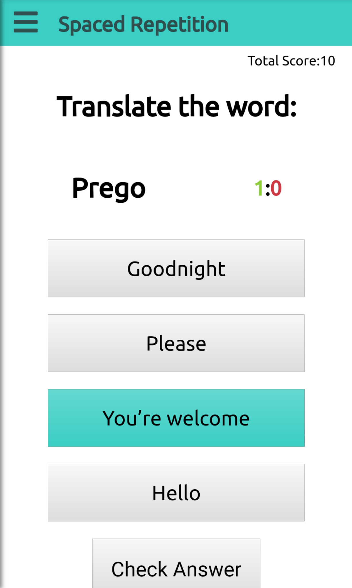
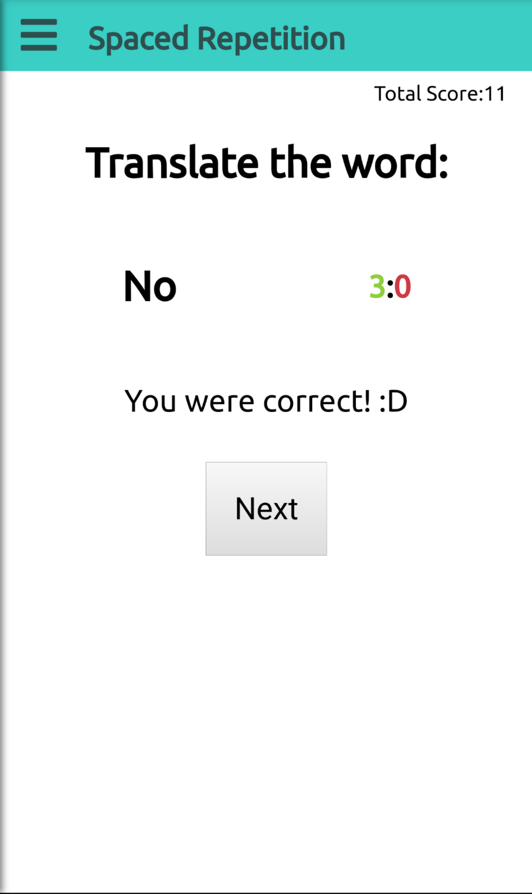
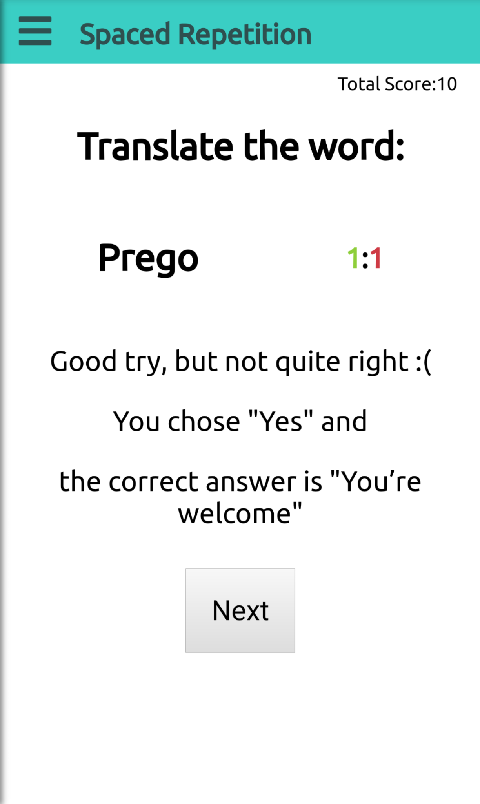

# Spaced Repetition - Learn Italian

## demo account
Username: demo
Password: Passw0rd#

## Registration page

### User story:

As a prospective user, I can register an account so that I can login and use the application.

#### Acceptance criteria:

As a first time user:
- I'm directed to a registration page.
- On that page, I can enter my name, username, and password.
- If all of my information is correct, upon clicking the submit button, I'm taken to the login page.
- If any of my information is incorrect, I'm given an appropriate error message and the option to correct my information.

## Login page

### User story:

As a registered user, I can login to the application so that I can begin learning.

### Acceptance criteria:

On any visit when I'm not logged in:
- I can navigate to the "login" page.

As a registered user on the login page:
- I can navigate back to the registration page.
- I can enter my username and password.
- If my submitted username and password are incorrect, I'm given an appropriate error message so that I can attempt to login again.
- If my submitted username and password are correct, the app "logs me in" and redirects me to my dashboard.

As a logged in user:
- The app displays my name and presents a logout button.
- The application refreshes my auth token so that I can remain logged in while active on the page.

As a logged in user who is starting a new session:
- The application remembers that I'm logged in and doesn't redirect me to the registration page.

## Dashboard page

### User story:

As a logged in user, I'm directed to a dashboard where I can see my progress learning my language.

#### Acceptance criteria:

When viewing the dashboard as a logged in user:

- The app gets my language and words progress from the server
- I'm shown my language
- I'm shown the words to learn for the language
- I'm shown my count for correct and incorrect responses for each word
- I'm given a button/link to start learning
- I'm shown the total score for guessing words correctly

## Learning page

### User story:

As a logged in user, I can learn words using spaced repetition.

#### Acceptance criteria:

When viewing the learning page as a logged in user:

- The app gets my next word to learn details from the server
- I'm shown the word to learn
- I'm shown my current total score
- I'm shown the number of correct and incorrect guesses for that word
- I'm presented an input to type my answer/guess for the current words translation

### User story:

As a logged in user, I can see feedback on my submitted answers.

#### Acceptance criteria:

After submitting an answer on the learning page as a logged in user:

- The app POSTs my answer for this word to the server
- The server will update my appropriate scores in the database
- After submitting, I get feedback whether I was correct or not
- After submitting, I'm told the correct answer
- My total score is updated
- I'm told how many times I was correct and incorrect for the word
- I can see a button to try another word

### User story:

As a logged in user, I can learn another word after receiving feedback from my previous answer

#### Acceptance criteria:

When viewing feedback for an answer on the learning page as a logged in user:

- I'm presented with a button that I can click to learn another word
- When clicking on the button I see the next word to learn

## Side Bar Navigation

## Color choices

-header background
    #3ACEC4
    58, 206, 196

-red
    #CE3A44
    206, 58, 68

- green
    #8ECE3A
    142, 206, 58
